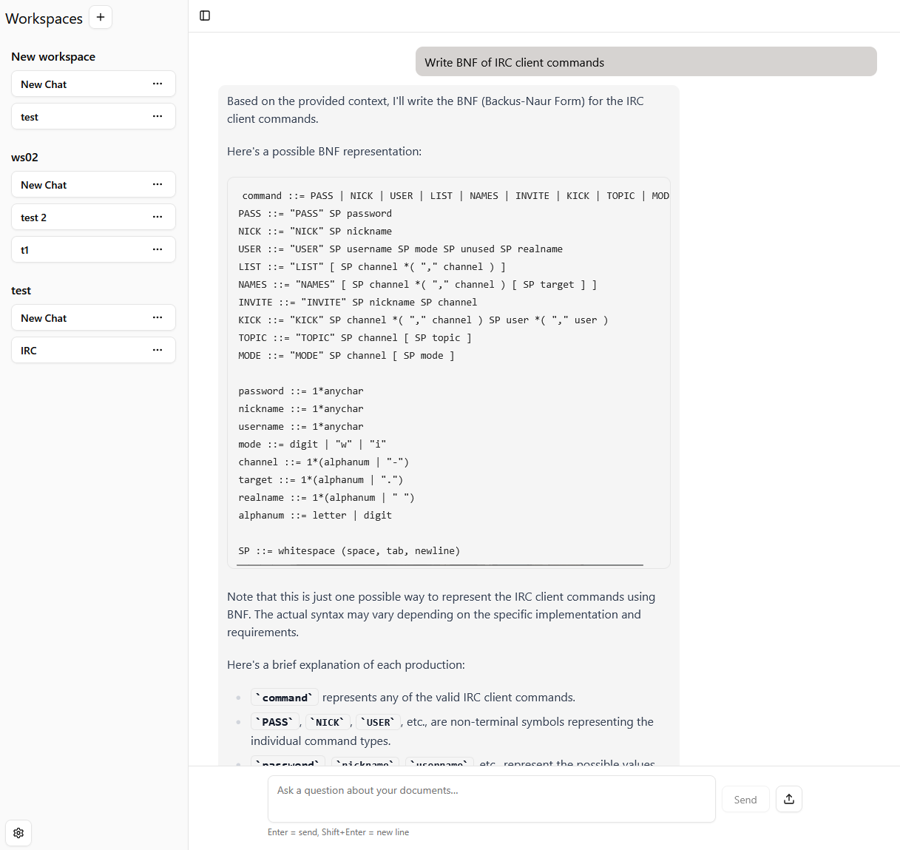
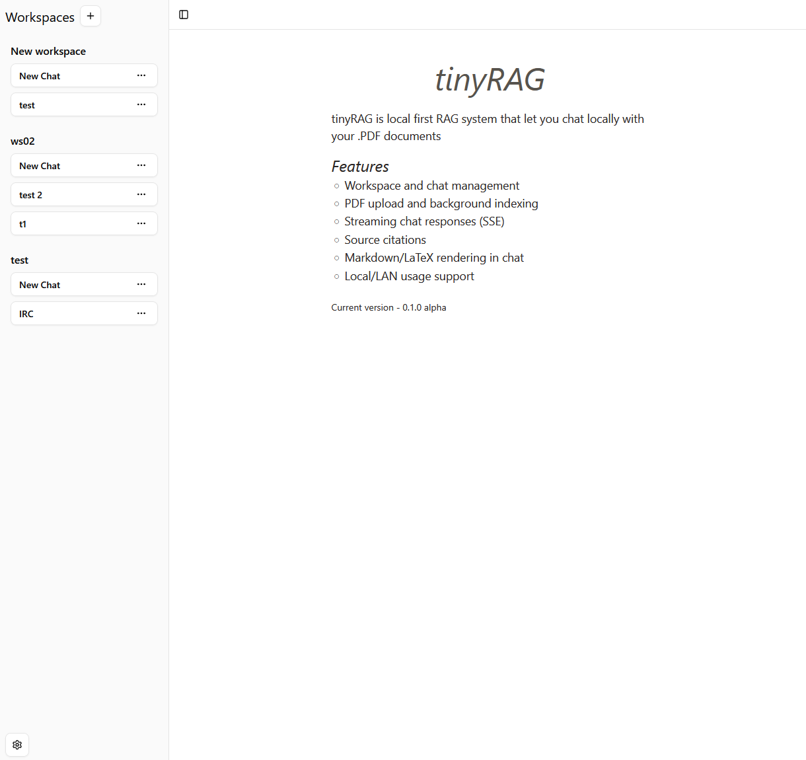
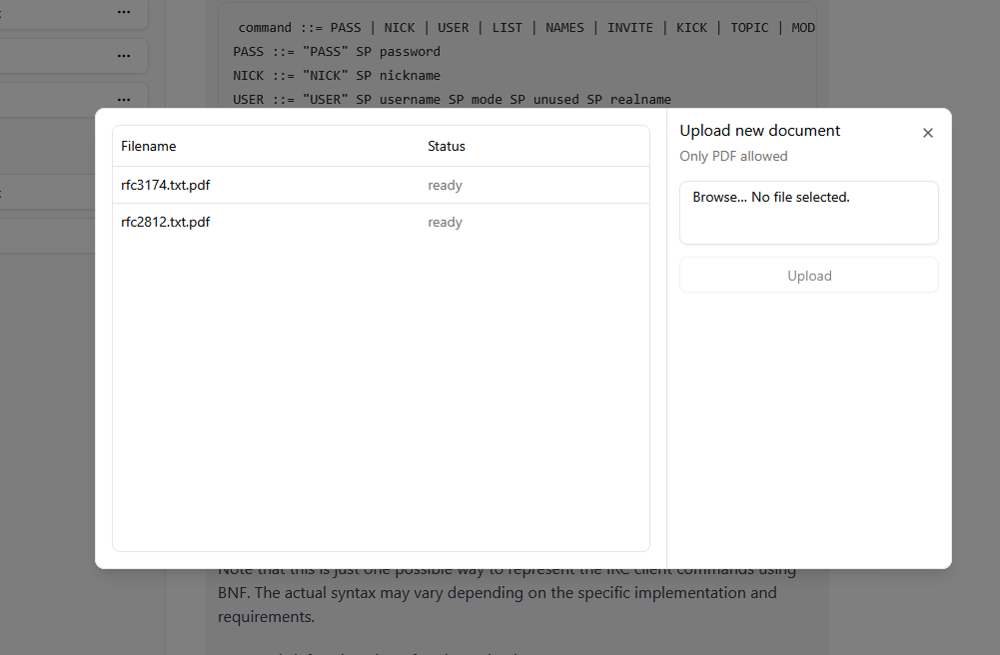

# tinyRAG 🍜


Local-first RAG assistant with:
- Next.js frontend (`frontend/`)
- FastAPI backend (`api.py`)
- ChromaDB vector store (`data/chroma`)
- SQLite app database (`data/app.db`)


## Demo 



<details>
  <summary>More screenshots</summary>
  
  
  
  
</details>

## Features
- Workspace and chat management
- PDF upload and background indexing
- Streaming chat responses (SSE)
- All core data stays on your machine: SQLite + ChromaDB
- Markdown/LaTeX rendering in chat
- Use it on LAN by pointing clients to your backend host

## Architecture
- Frontend: Next.js + React + shadcn/ui
- Backend: FastAPI + aiohttp + sentence-transformers
- Retrieval: Chroma vector search (workspace-scoped)
- Persistence: SQLite for app entities and metadata

## Requirements
- Python 3.11+
- [uv](https://docs.astral.sh/uv/)
- Node.js 20+
- pnpm 9+
- Ollama running with your selected model

## Quick Start (Windows)
1. Setup requirements
- Fast API `uv sync`
- Next.JS `pnpm install` (inside frontend directory)

2. Start backend + frontend:

```powershell
.\Start.ps1
```

3. Open app:
- Frontend: `http://localhost:3000`
- Backend: `http://localhost:8000`

## Configuration

### Backend
- File: `CONFIG.toml`
- Main options:
  - server upload path and model name
  - Chroma persistence path/collection
  - embedding model

### Frontend API base
Set in `frontend/.env`:
```env
NEXT_PUBLIC_API_BASE_URL=http://localhost:8000
```
For LAN usage, set it to your backend machine IP:
```env
NEXT_PUBLIC_API_BASE_URL=http://192.168.x.x:8000
```

Important: restart frontend after changing `.env`.

## Build Instructions

### Frontend production build
```powershell
cd frontend
pnpm build
pnpm start -- --hostname 0.0.0.0 --port 3000
```

### Backend production run
```powershell
uv run uvicorn api:app --host 0.0.0.0 --port 8000
```

## Project Structure
```text
api.py
chroma.py
database.py
CONFIG.toml
shared.py
Start.ps1
Setup.ps1
frontend/
  app/
  components/
  package.json
```

## Roadmap
- Hybrid retrieval (vector + keyword)
- Config/settings UI
- Improved evaluation and observability
- Optional packaging for non-dev users

## License

This project is licensed under the GNU General Public License v3.0 (GPL-3.0).
See the [LICENSE](./LICENSE) file for details.