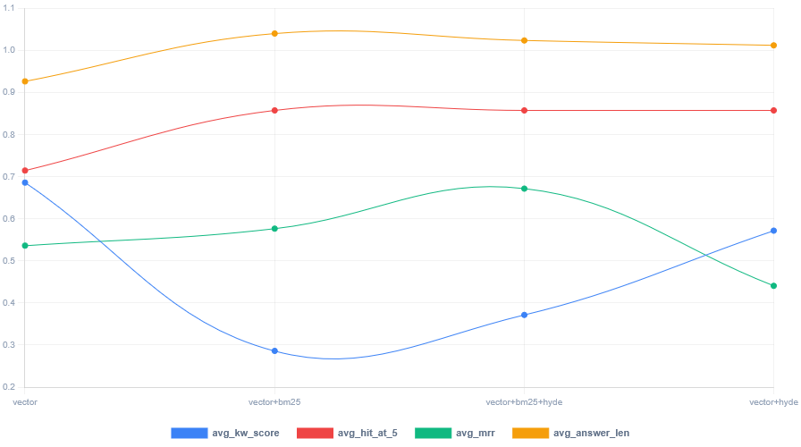
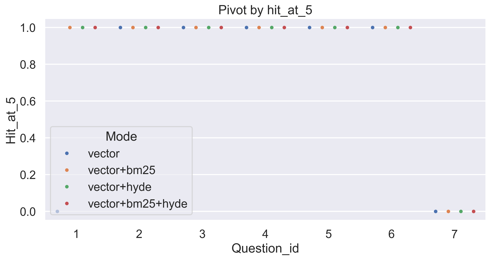
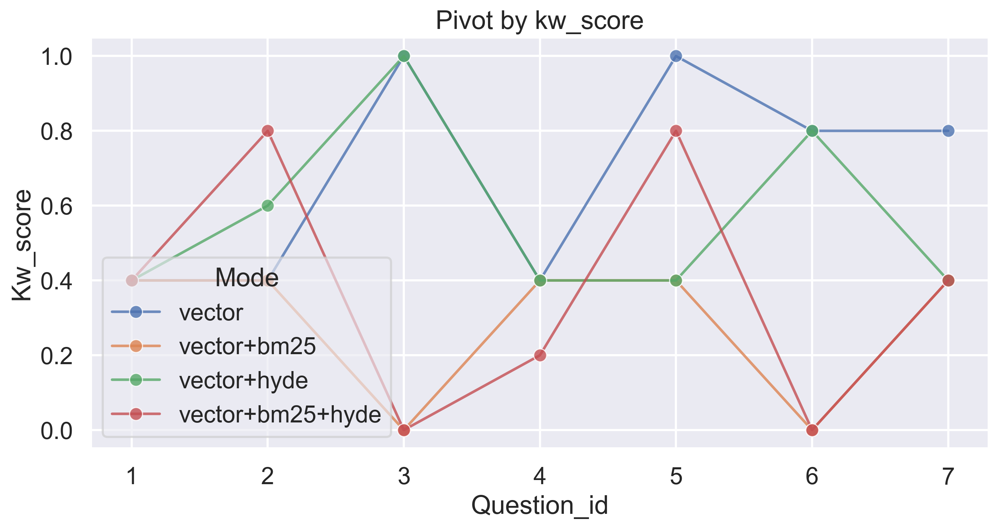
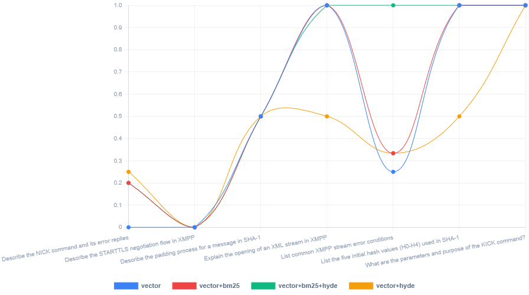
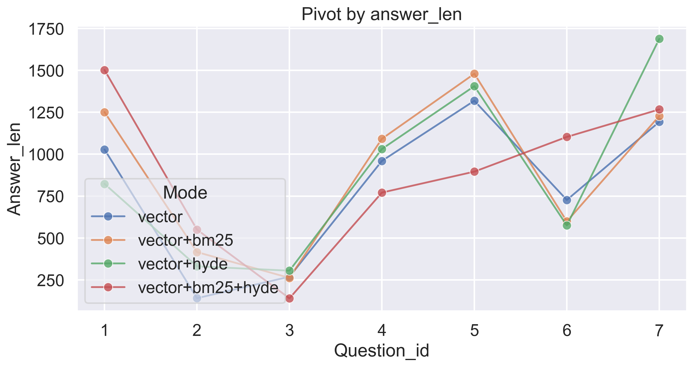

# tinyRAG 🍜

Local-first RAG assistant with:
- Next.js frontend (`frontend/`)
- FastAPI backend (`api.py`)
- ChromaDB vector store (`data/chroma`)
- SQLite app database (`data/app.db`)


## Demo 


<details>
  <summary>More screenshots</summary>
  
  
  
  
</details>

## What's New in v0.3.0

- Added retrieval evaluation suite (`src/testing/features_test.py`)
- Added automatic report generation (`src/testing/report_gen.py`)
- Added per-mode metric exports (`metrics.csv`, `metrics_summary_by_mode.csv`)
- Added chart generation for summary and per-question analysis
- Updated README with benchmark methodology and results

### Retrieval Modes

1. Vector only
2. Vector + BM25 (default recommended)
3. Vector + BM25 + HyDE (optional, best for some vague queries)


## Features
- Workspace and chat management
- PDF upload and background indexing
- Hybrid search + HyDE
- JSON chat exporting
- Streaming chat responses (SSE)
- All core data stays on your machine: SQLite + ChromaDB
- Markdown/LaTeX rendering in chat
- Use it on LAN by pointing clients to your backend host

## Architecture
- Frontend: Next.js + React + shadcn/ui
- Backend: FastAPI + aiohttp + sentence-transformers
- Retrieval: Chroma vector search (workspace-scoped)
- Persistence: SQLite for app entities and metadata

## Evaluation

### Setup
- Dataset: 7 fixed questions across RFC2812, RFC3174, RFC6120
- Modes: `vector`, `vector+bm25`, `vector+hyde`, `vector+bm25+hyde`
- Retrieval depth: `k=8`
- Model: `llama3:8b-instruct-q4_K_M`
- Metrics:
  - `avg_kw_score`: expected keyword coverage in answer (0..1)
  - `avg_hit_at_5`: whether gold citation appears in top-5 retrieved chunks
  - `avg_mrr`: reciprocal rank of first gold chunk
  - `avg_answer_len`: normalized answer length (0..1, higher = longer)
  - `abs_answer_len`: absolute answer length (used in mean metrics only)

> ⚠️ This is a small directional benchmark (7 questions across 4 modes).

### Mean Metrics by Mode

| mode             | avg_kw_score | avg_hit_at_5 | avg_mrr | abs_answer_len |
| ---------------- | -----------: | -----------: | ------: | -------------: |
| vector           |        0.686 |        0.714 |   0.536 |            805 |
| vector+bm25      |        0.286 |        0.857 |   0.576 |            904 |
| vector+bm25+hyde |        0.371 |        0.857 |   0.671 |            889 |
| vector+hyde      |        0.571 |        0.857 |   0.440 |            879 |


### Visuals


_Summary by mode_

<details>
  <summary>Metrics per question</summary>
  
  
  _Per-query Hit@5_

  
  _Per-query Keyword Score_

  
  _Per-query MRR_

  
  _Per-query Answer length_
</details>


### Conclusion
- Best `MRR` produced by `vector+bm25+hyde`, but it is also the most expensive (extra HyDE request).
- Best `avg_kw_score` produced by `vector`.
- Best practical retrieval tradeoff (`hit@5` + `MRR` vs cost) is `vector+bm25`,for many tasks it's the best working mode.


### How to Reproduce Tests
1. Start testing with `src/testing/features_test.py`, this module evaluates N prepared questions in different modes and saves results in `src/testing/results` in `.csv` format
2. Generate report with `src/testing/report_gen.py`, this module generates separate `.csv` files per each metric and after generates plots.

## Requirements
- Python 3.11+
- [uv](https://docs.astral.sh/uv/)
- Node.js 20+
- pnpm 9+
- Ollama running with your selected model

## Quick Start (Windows)
1. Setup requirements
- Fast API `uv sync`
- Next.JS `pnpm install` (inside frontend directory)

2. Start backend + frontend:

```powershell
.\Start.ps1
```

3. Open app:
- Frontend: `http://localhost:3000`
- Backend: `http://localhost:8000`

## Configuration

### Backend
- File: `CONFIG.toml`
- Main options:
  - server upload path and model name
  - Chroma persistence path/collection
  - embedding model

### Frontend API base
Set in `frontend/.env`:
```env
NEXT_PUBLIC_API_BASE_URL=http://localhost:8000
```
For LAN usage, set it to your backend machine IP:
```env
NEXT_PUBLIC_API_BASE_URL=http://192.168.x.x:8000
```

Important: restart frontend after changing `.env`.

## Build Instructions

### Frontend production build
```powershell
cd frontend
pnpm build
pnpm start -- --hostname 0.0.0.0 --port 3000
```

### Backend production run
```powershell
uv run uvicorn api:app --host 0.0.0.0 --port 8000
```

## Project Structure
```text
src/
  api.py
  chroma.py
  database.py
  CONFIG.toml
  shared.py
  hybrid_search.py
  testing/
    features_test.py
    report_gen.py
Start.ps1
frontend/
  app/
  components/
  package.json
frontend_lite
```

## Additional frontend variant
- **frontend_lite** - small frontend version without framework dependencies

## Roadmap
- [x] Hybrid retrieval (vector + keyword)
- [x] Config/settings UI
- [x] Create evaluation report
- [ ] Improved evaluation and observability
- [ ] Optional packaging for non-dev users

## License

This project is licensed under the GNU General Public License v3.0 (GPL-3.0).
See the [LICENSE](./LICENSE) file for details.