# tinyRAG 🍜


> [!IMPORTANT]
> Project moved to codeberg: https://codeberg.org/Enji/tinyRAG


**tinyRAG** is a Local-first RAG workbench for PDF question answering, retrieval experiments, and portable Windows deployment.

Key features:
- Per-workspace retrieval settings: top_k, BM25, HyDE
- Portable Windows build via PyInstaller
- Static frontend served by FastAPI


Stack:
- FastAPI backend (`api.py`)
- ChromaDB vector store (`data/chroma`)
- SQLite app database (`data/app.db`)
- Next.js frontend (`frontend/`)

## Demo 

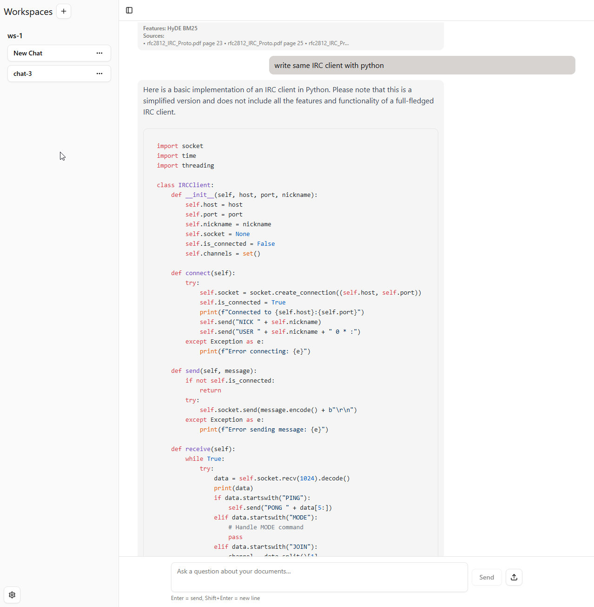

<details>
  <summary>More screenshots</summary>
  
  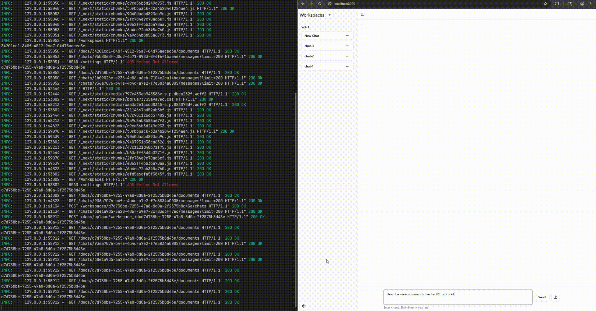
  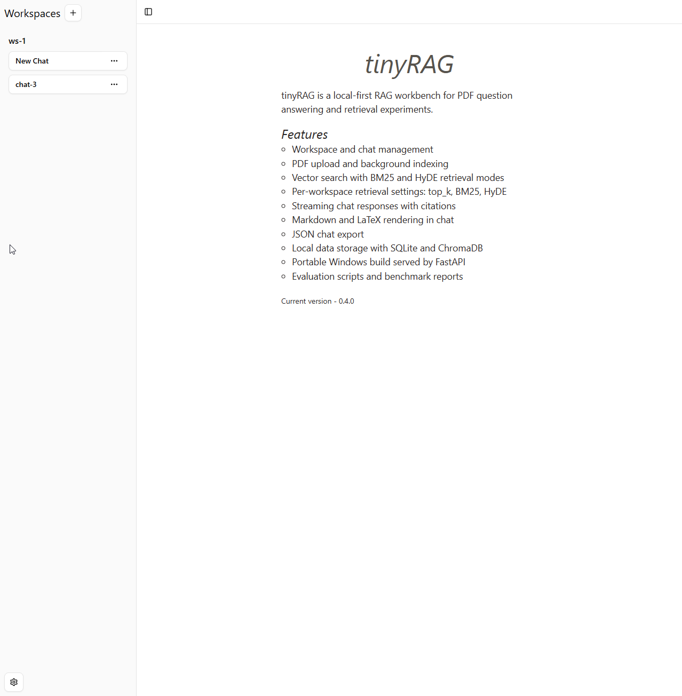
  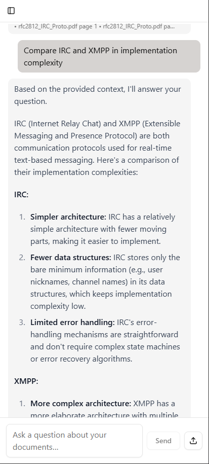
  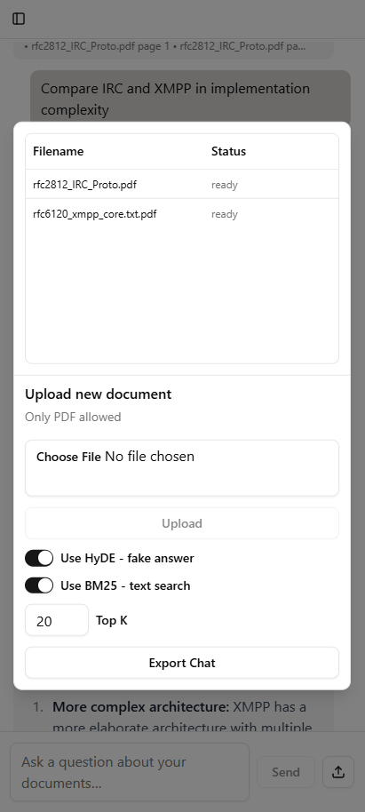
</details>

## What's New in v0.4.0

- Converted the Next.js frontend to static export mode.
- FastAPI now serves both the API and static frontend.
- Added portable Windows build support with PyInstaller.
- Added portable runtime data folder for config, SQLite, ChromaDB, uploads, and model cache.
- Split RAG logic into `RagService` for cleaner backend architecture.
- Added per-workspace retrieval settings: `top_k`, BM25, and HyDE.
- Removed dynamic frontend routes in favor of client-side active chat state.
- Added per-message metadata for assistant responses, including citations and retrieval settings used during generation.


### Retrieval Modes

1. Vector only
2. Vector + BM25 (default recommended)
3. Vector + BM25 + HyDE (optional, best for some vague queries)


## Features
- Workspace and chat management
- PDF upload and background indexing
- Hybrid search + HyDE
- JSON chat exporting
- Streaming chat responses (SSE)
- All core data stays on your machine: SQLite + ChromaDB
- Markdown/LaTeX rendering in chat
- Use it on LAN by pointing clients to your backend host

## Architecture

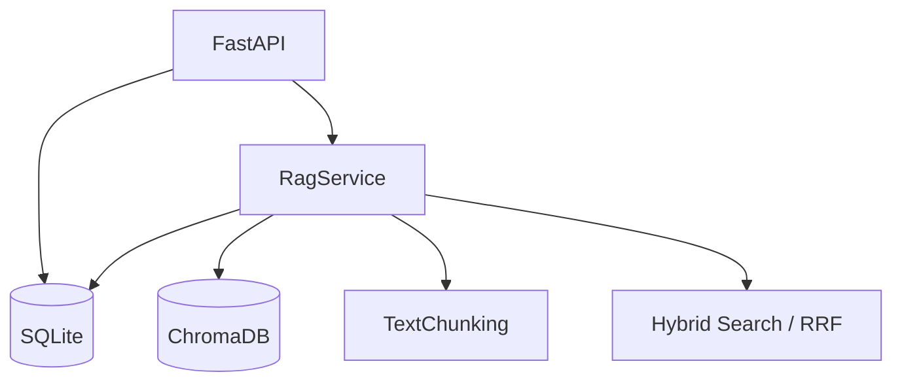
```mermaid
flowchart TD
    F[FastAPI] --> R[RagService]
    F[FastAPI] --> D[(SQLite)]

    R --> D[(SQLite)]
    R --> C[(ChromaDB)]
    R --> T[TextChunking]
    R --> H[Hybrid Search / RRF]
```

- Frontend: Next.js + React + shadcn/ui
- Backend: FastAPI + aiohttp + sentence-transformers
- Retrieval: Chroma vector search (workspace-scoped)
- Persistence: SQLite for app entities and metadata

## Evaluation

### Setup
- Dataset: 7 fixed questions across RFC2812, RFC3174, RFC6120
- Modes: `vector`, `vector+bm25`, `vector+hyde`, `vector+bm25+hyde`
- Retrieval depth: `k=8`
- Model: `llama3:8b-instruct-q4_K_M`
- Metrics:
  - `avg_kw_score`: expected keyword coverage in answer (0..1)
  - `avg_hit_at_5`: whether gold citation appears in top-5 retrieved chunks
  - `avg_mrr`: reciprocal rank of first gold chunk
  - `avg_answer_len`: normalized answer length (0..1, higher = longer)
  - `abs_answer_len`: absolute answer length (used in mean metrics only)

> ⚠️ This is a small directional benchmark (7 questions across 4 modes).
 
### Mean Metrics by Mode

| mode             | avg_kw_score | avg_hit_at_5 | avg_mrr | abs_answer_len |
| ---------------- | -----------: | -----------: | ------: | -------------: |
| vector           |        0.686 |        0.714 |   0.536 |            805 |
| vector+bm25      |        0.286 |        0.857 |   0.576 |            904 |
| vector+bm25+hyde |        0.371 |        0.857 |   0.671 |            889 |
| vector+hyde      |        0.571 |        0.857 |   0.440 |            879 |


### Visuals

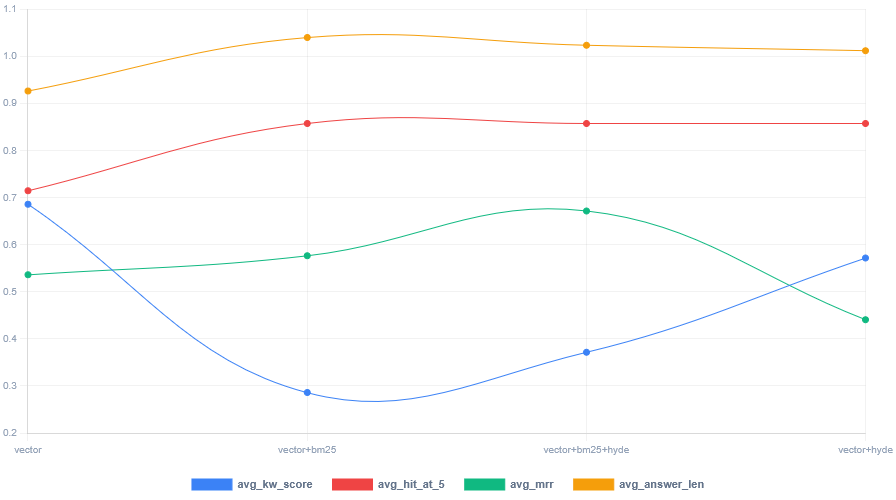
_Summary by mode_

<details>
  <summary>Metrics per question</summary>
  
  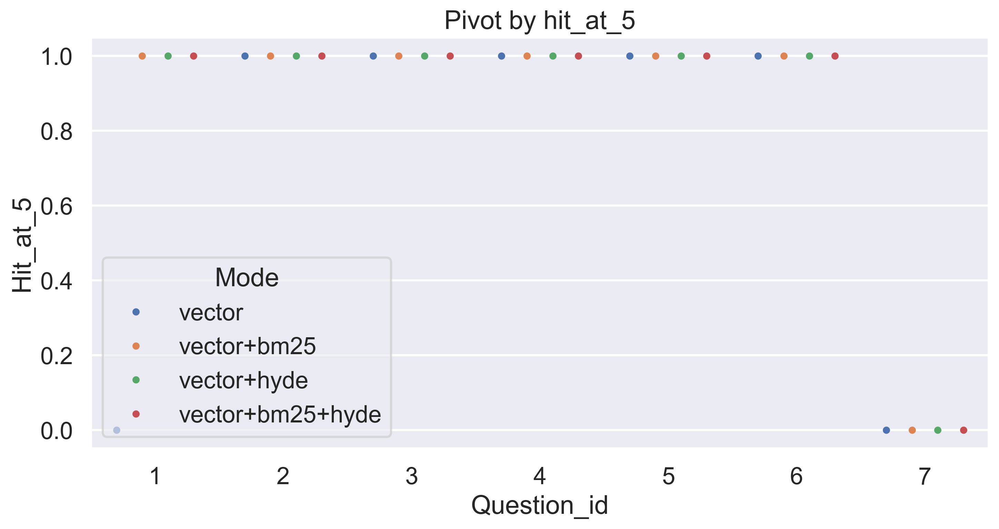
  _Per-query Hit@5_

  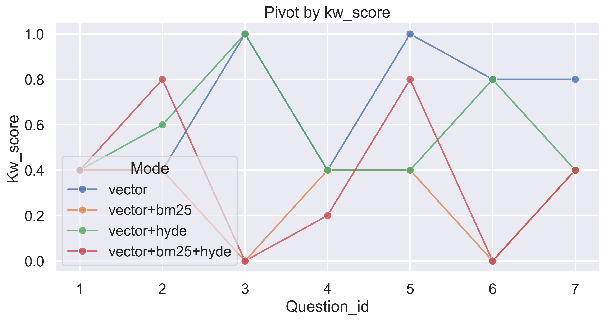
  _Per-query Keyword Score_

  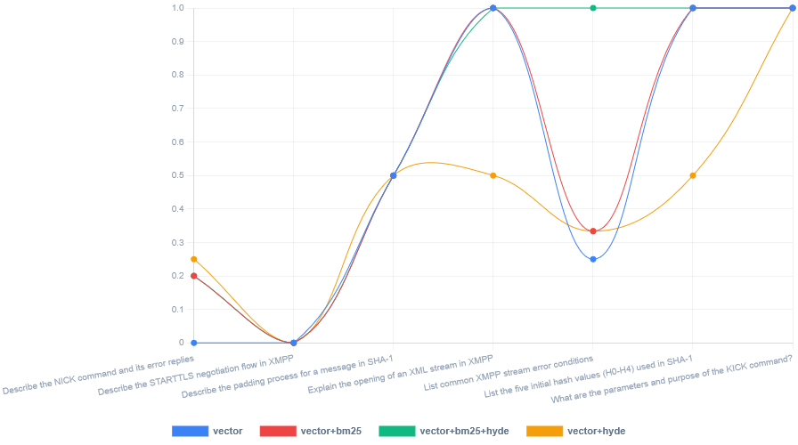
  _Per-query MRR_

  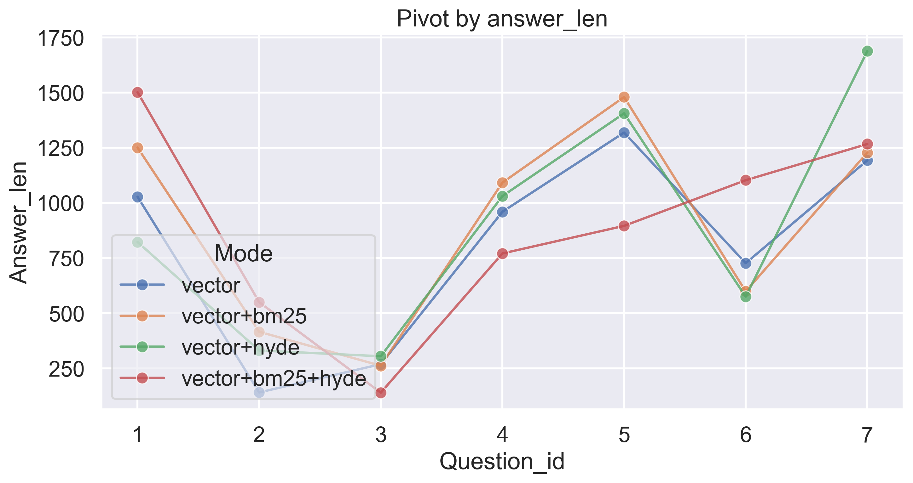
  _Per-query Answer length_
</details>


### Conclusion
- Best `MRR` produced by `vector+bm25+hyde`, but it is also the most expensive (extra HyDE request).
- Best `avg_kw_score` produced by `vector`.
- Best practical retrieval tradeoff (`hit@5` + `MRR` vs cost) is `vector+bm25`,for many tasks it's the best working mode.


### How to Reproduce Tests
1. Start testing with `src/testing/features_test.py`, this module evaluates N prepared questions in different modes and saves results in `src/testing/results` in `.csv` format
2. Generate report with `src/testing/report_gen.py`, this module generates separate `.csv` files per each metric and after generates plots.

## Quick Start

- Make sure Ollama is running and the configured model is pulled.
- Configure your local ollama endpoint inside `CONFIG.toml`.
- Download or build tinyRAG, then run: `tinyRAG.exe`.
- Open `http://localhost:8000`.
- All runtime data is stored inside `data/` folder.

If building from source, the executable is created at: `dist/tinyRAG/tinyRAG.exe`

## Configuration

### Backend
- File: `data/CONFIG.toml`
- Main options:
  - Server upload path and model name
  - Chroma persistence path/collection
  - Embedding model

### Frontend API Base for Development
Set in `frontend/.env`:
```env
NEXT_PUBLIC_API_BASE_URL=http://localhost:8000
```
For LAN usage, set it to your backend machine IP:
```env
NEXT_PUBLIC_API_BASE_URL=http://192.168.x.x:8000
```

Important: restart frontend after changing `.env`.

## Build Instructions (Windows)

### Requirements

- Python 3.11+
- uv
- Node.js 20+
- pnpm
- Ollama with the selected model
  
### Build Portable Windows App

Run from repository root:
```
.\Build.ps1 -Frontend -Backend
```
- `-Frontend` - builds the static Next.js frontend.
- `-Backend`  - packages the FastAPI backend with PyInstaller. 

Use both flags for a full portable build.


## Project Structure
```text
frontend/
  app/
  components/
  package.json
src/
  main.py
  api.py
  rag_service.py
  chroma.py
  database.py
  shared.py
  hybrid_search.py
  testing/
    features_test.py
    report_gen.py
data/
  CONFIG.toml
Build.ps1
```

## Additional frontend variant
- **frontend_lite** - small frontend version without framework dependencies

## Roadmap
- [x] Hybrid retrieval (vector + keyword)
- [x] Config/settings UI
- [x] Create evaluation report
- [x] Optional packaging for non-dev users
- [ ] Improved evaluation and observability


## License

This project is licensed under the GNU General Public License v3.0 (GPL-3.0).
See the [LICENSE](./LICENSE) file for details.